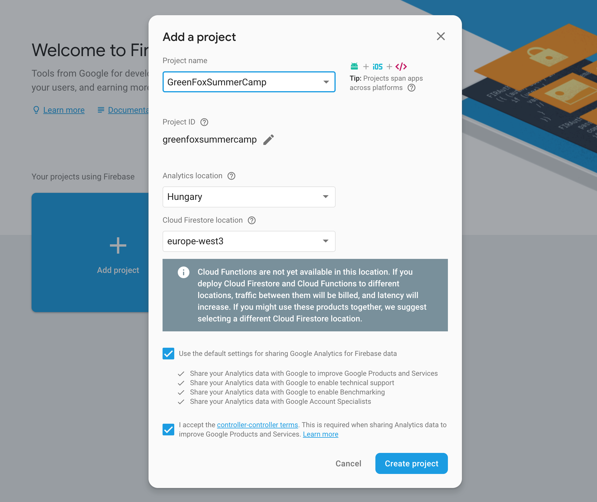

# Making your blog Persistent

## Setting up a project in Firebase
Firebase is a cloud based database, perfect for storing our blog posts safely.

### Creating a new Project
- Go to the [Firebase Console](https://console.firebase.google.com/)
  - Login with your Google Account
- Add a new Project
  - You can name it as you like
  - But choose `Hungary` and `europe-west3`

- Wait a little while Google creates the storage for you, then continue

### Configuring your app and Firebase
In order to use Firebase in the blog, we'll need some identification, to prove we're the ones who created this project, hence we're able to store data here. Also we need to set up the storage, because Firebase can be used for many more. For now this is going to be the only feature we'll use.
- On the dashboard click on the Add to web project button to get the needed code for authentication

- Copy the snippet that looks similar to this:
```javascript
<script src="https://www.gstatic.com/firebasejs/5.4.0/firebase.js"></script>
<script>
  // Initialize Firebase
  var config = {
    apiKey: "-----This is your api key, it should be a secret!----",
    authDomain: "greenfoxsummercamp.firebaseapp.com",
    databaseURL: "https://greenfoxsummercamp.firebaseio.com",
    projectId: "greenfoxsummercamp",
    storageBucket: "greenfoxsummercamp.appspot.com",
    messagingSenderId: "670705307876"
  };
  firebase.initializeApp(config);
</script>
```
- Paste it in your `index.html` for now before closing the `<body>` tag and before your `javascript` file's inclusion
- Get to the `Database` section (it is under the `Development` menu item if it's not open)
- Create a database there
  - Change the `Cloud FireStore BETA` to `Realtime Database`
  - And change the rules, so we're able to read and write data from our application and not just from the console itself:
```json
{
  "rules": {
    ".read": true,
    ".write": true
  }
}
```
- Let's edit your `index.html` file, we have to initialize the connection to the database:
```javascript
...
firebase.initializeApp(config);
fb = firebase.database();
...
```
- Now everything is properly set up

## Saving a new post
Firebase's Realtime Database can store any type of data. The data has always a path where it is available, so when saving a post we need to set the path to it and create a proper data object.
- Let's say our first post should be under the path of `posts/1`, indicating that it is a post and it is the first one
- The data should look like this:
```javascript
let path = "posts/1";
let dataToSave = {
  title: "My first saved blog post",
  text: "Some hilarious content, which proves how awesome I am."
};
```
- (Obviously these texts should be read out from your `New Post` form)
- Saving the data is now this simple:
```javascript
fb.ref(path).set(dataToSave);
```

## Loading existing posts
Since we're collecting the posts under the paths like `posts/1`, `posts/2` and so on. Imagine these paths like directories and files. `posts` is the directory of posts and `1` and `2` are separate files in that. So we can retrieve all posts by providing the path of the "folder": `posts`
- The code looks like this:
```javascript
fb.ref("posts").once('value').then(data => {
  let savedPosts = data.val();
});
```

## Updating / deleting
Since we've already know how we can save the data under a specific path, updating it is just the same, we just have to use the same path, so basically we can override the existing data on a specific path.
```javascript
let samePath = "posts/1";
let updatedData = {
  title: "My first edited and updated blog post",
  text: "Some hilarious content again, which proves how awesome I am again."
};
fb.ref(samePath).set(updatedData);
```
For deleting we just need the specific path we want to remove, and use the `remove()` keyword:
```javascript
fb.ref("posts/2").remove();
```