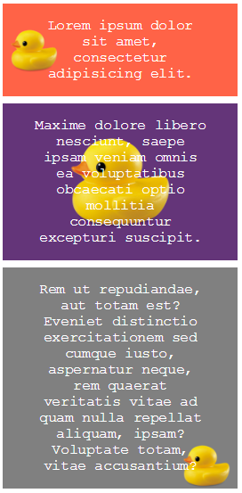

# Introduction to Web development basics

## Material Review
- Anatomy of an HTML element
- Nesting elements
- Block versus inline elements
- Empty elements
- Core elements
  - `div`
  - `span`
  - `h1` - `h6`
  - `p`
  - `a`
  - `img`
  - `ul`
  - `ol`
  - `li`
- Semantic elements
- Attributes
- Anatomy of an HTML document
- Whitespaces in HTML
- HTML comments
- Forms
  - `form`
  - `input`
  - `textarea`
  - `label`
  - `fieldset`
  - `legend`
- MDN Web Docs
- Anatomy of a CSS ruleset
- Selecting multiple elements
- Different types of selectors
  - Elements
  - Class
- The box model
- Core properties
  - `padding`
  - `border`
  - `margin`
  - `height`
  - `width`
  - `background`
  - `color`
  - `font-size`

## Workshop
- Separate your solutions into different folders
- Keep in mind that it does not have to be [pixel-perfect](http://lmgtfy.com/?q=What+does+%22pixel+perfect%22+mean%3F)
- Do not forget to download [the duck](assets/the-duck.png)
- Basic `HTML` structure:
```html
<html>
  <head>
    <style>
    </style>
    <!-- or have the styles in a separate styles.css file -->
    <link href="styles.css" rel="stylesheet">
  </head>
  <body>
  </body>
</html>
```

### Exercise 1


### Exercise 2


### Exercise 3


### Exercise 4


### Exercise 5


### Exercise 6 (optional)


### Exercise 7 (optional)


## Project exercise
Let's start building your blog!

[The blog project](blog-project.md)
